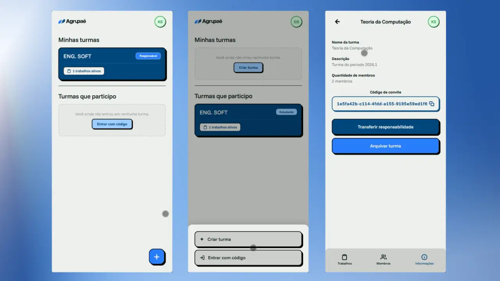
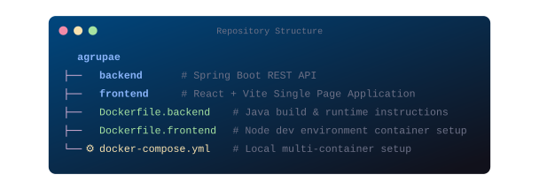

<p align="center">
  <a href="https://github.com/wendell-kenneddy/agrupae" target="_blank">
    
    <!---->
  </a>
</p>


<p align="center">
  A modern, decoupled web platform built to streamline the creation, management, and workflow of academic group assignments.
</p>

<p align="center">
  <a href="#about"></a>
  <a href="#demo"></a>
  <a href="#built-with"></a>
  <a href="#getting-started"></a>
  <a href="#environment-variables--security"></a>
  <a href="#contributing"></a>
</p>
</br>
<p align="center">
  
</p>
<h2>About</h2>

Agrupaê is all about easing the friction between academic group assignments and the creation of such groups, allowing users to easily manage them. It features a robust Java/Spring Boot backend REST API and a fast, responsive React frontend.

<p align="center">
  
</p>

<h2>Demo</h2>

<p align="center">
  
</p>

<p align="center">
  
</p>

<h2>Built With</h2>

This project is built using the following major frameworks, libraries, and tools:

* [![React][React-shield]][React-url]
* [![Vite][Vite-shield]][Vite-url]
* [![Java][Java-shield]][Java-url]
* [![Spring Boot][Spring-shield]][Spring-url]
* [![PostgreSQL][Postgres-shield]][Postgres-url]
* [![Docker][Docker-shield]][Docker-url]

[React-shield]: https://img.shields.io/badge/React-20232A?style=for-the-badge&logo=react&logoColor=61DAFB
[React-url]: https://react.dev/
[Vite-shield]: https://img.shields.io/badge/Vite-646CFF?style=for-the-badge&logo=vite&logoColor=FFD62B
[Vite-url]: https://vite.dev/
[Java-shield]: https://img.shields.io/badge/Java-ED8B00?style=for-the-badge&logo=openjdk&logoColor=white
[Java-url]: https://www.oracle.com/java/
[Spring-shield]: https://img.shields.io/badge/Spring_Boot-6DB33F?style=for-the-badge&logo=spring-boot&logoColor=white
[Spring-url]: https://spring.io/projects/spring-boot
[Postgres-shield]: https://img.shields.io/badge/PostgreSQL-316192?style=for-the-badge&logo=postgresql&logoColor=white
[Postgres-url]: https://www.postgresql.org/
[Docker-shield]: https://img.shields.io/badge/Docker-2496ED?style=for-the-badge&logo=docker&logoColor=white
[Docker-url]: https://www.docker.com/

<p align="center">
  
</p>

## Getting Started

The easiest way to run the entire stack (Frontend, Backend, Database, and migrations) is using Docker Compose.

### Prerequisites
Make sure you have the following installed on your machine:
- Docker
- Docker Compose

### Execution Steps

1. **Clone the Repository:**
   ```bash
   $ git clone https://github.com/wendell-kenneddy/agrupae.git
   $ cd agrupae
   ```


2. **Spin up all containers:**
   Run the following command at the project root to fetch dependencies, build the application, and start the services:
   ```bash
   $ docker compose up --build
   ```

  >[!NOTE]
   >The Flyway container will automatically execute database migrations and exit successfully before the backend fully boots up.

4. **Accessing the Applications:**
   Once initialization completes, you can access the applications at:
   - **Frontend (Web Application):** [http://localhost:5173](http://localhost:5173)
   - **Backend (API REST):** [http://localhost:8081](http://localhost:8081)
   - **Database (PostgreSQL):** Exposed on port `6543` locally.

5. **Tearing Down Services:**
   To stop and remove all container resources, run:
   ```bash
   $ docker compose down
   ```
</br>


<p align="center">
  
</p>

<h2>Environment Variables & Security</h2>

The project's local development credentials and configs are predefined in the `docker-compose.yml` file.

During the backend build process (`Dockerfile.backend`), automated security actions are executed:
- The `src/main/resources/certs` directory is created.
- RSA Private (`private.pem`) and Public (`public.pem`) 2048-bit key-pairs are generated dynamically using `openssl`.
- These keys are bundled into the Spring Boot package to handle asymmetric JWT signing and verification.

<p align="center">
  
</p>

<h2>Repository Structure</h2>

<p align="left">
  
</p>

<p align="center">
  
</p>

<h2>Contributing</h2>

Contributions must follow the guidelines set in the `CONTRIBUTING.md` file under the `docs` directory.

<h2>Authors</h2>

<table align="center">
  <tr>
    <td align="center">
      <a href="https://github.com/wendell-kenneddy">
        <br />
        <sub><b>Wendell Kenneddy</b></sub>
      </a>
    </td>
    <td align="center">
      <a href="https://github.com/kelvinsbez">
        <br />
        <sub><b>Kelvin Bezerra</b></sub>
      </a>
    </td>
    <td align="center">
      <a href="https://github.com/jeremiasvictor">
        <br />
        <sub><b>Jeremias Victor</b></sub>
      </a>
    </td>
    <td align="center">
      <a href="https://github.com/guilhermedevbr06">
        <br />
        <sub><b>Guilherme Silva</b></sub>
      </a>
    </td>
  </tr>
</table>

<h2>License</h2>

This project is licensed under the [MIT License](LICENSE).
